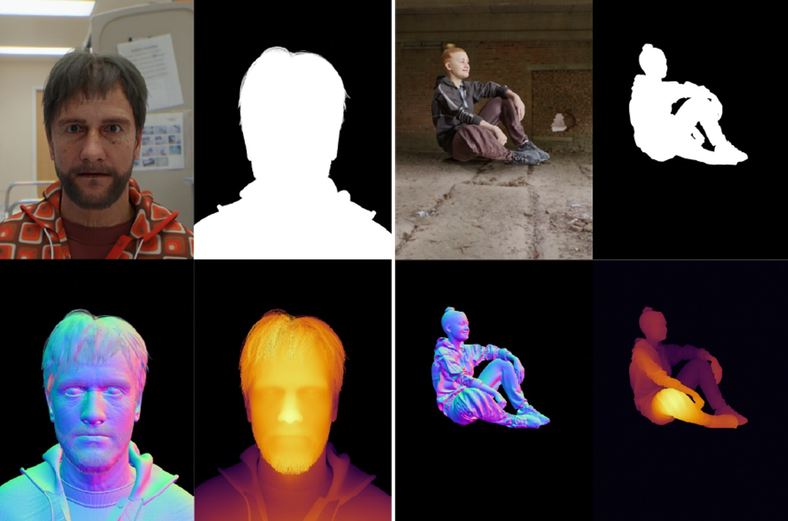

# DAViD: Data-efficient and Accurate Vision Models from Synthetic Data

The repo accompanies the ICCV 2025 paper [DAViD: Data-efficient and Accurate Vision Models from Synthetic Data](https://microsoft.github.io/DAViD) and contains instructions for downloading and using the SynthHuman dataset and models described in the paper.

## The SynthHuman Dataset


The SynthHuman dataset contains approximately 300,000 images of synthetic humans with ground-truth annotations for foreground alpha masks, absolute depth, surface normals and camera intrinsics. There are approximately 100,000 images for each of three camera scenarios: face, upper-body and full-body. The data is generated using the latest version of our synthetic data generation pipeline, which has been used to create a number of datasets: [Face Synthetics](https://microsoft.github.io/FaceSynthetics/), [SimpleEgo](https://aka.ms/SimpleEgo) and [SynthMoCap](https://aka.ms/SynthMoCap). Ground-truth annotations are per-pixel with perfect accuracy due to the graphics-based rendering pipeline:



### Data Format

The dataset contains TODO samples. Each sample is made up of:

- `rgb_0000000.png` - RGB image
- `alpha_0000000.png` - foreground alpha mask
- `depth_0000000.exr` - absolute z-depth image in cm
- `normal_0000000.exr` - surface normal image (XYZ)
- `cam_0000000.txt` - camera intrinsics (see below)

The camera text file includes the standard intrinsic matrix:

```
f_x   0 c_x
  0 f_y c_y
  0   0   1
```

Where `f_x`, and `f_y` are in pixel units.
This can be easily loaded with `np.loadtxt(path_to_camera_txt)`.

### Downloading the Dataset

The dataset is broken in TODO zip files to make downloading easier.
Each zip file is approximately 8.75GB in size and contains 5000 samples.
To download the dataset simply run `download_data.py TARGET_DIRECTORY [--single-sample] [--single-chunk]` which will download and unzip the zips into the target folder.
You can optionally download a single sample or a single chunk to quickly take a look at the data.

### License

The SynthHuman dataset is available for **non-commercial** use, refer to [LICENSE.txt](/LICENSE.txt) for details.

## DAViD Models

TODO

## Citation

If you use the SynthHuman Dataset or any of the DAViD models in your research, please cite the following:

```bibtex
@inproceedings{saleh2025david,
    title={{DAViD}: Data-efficient and Accurate Vision Models from Synthetic Data},
    author={Saleh, Fatemeh and Aliakbarian, Sadegh and Hewitt, Charlie and Petikam, Lohit and Xiao, Xian and Criminisi, Antonio and Cashman, Thomas J. and Baltru{\v{s}}aitis, Tadas},
    booktitle={Proceedings of the IEEE/CVF International Conference on Computer Vision (ICCV)},
    year={2025},
    month={October}
}
```
