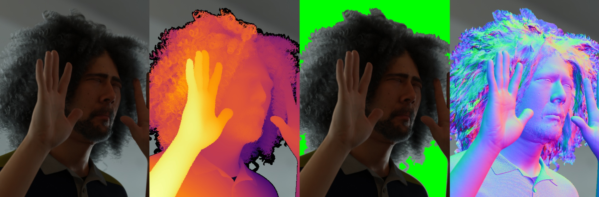
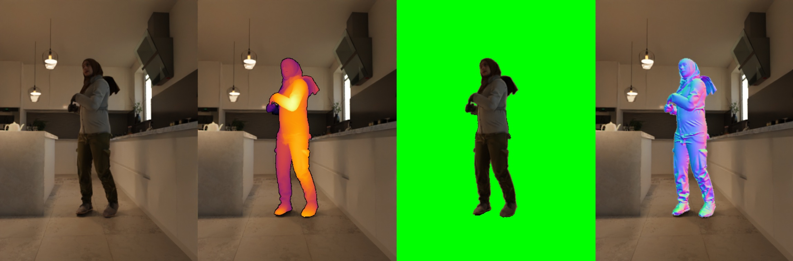

# DAViD: Data-efficient and Accurate Vision Models from Synthetic Data

The repo accompanies the ICCV 2025 paper [DAViD: Data-efficient and Accurate Vision Models from Synthetic Data](https://microsoft.github.io/DAViD) and contains instructions for downloading and using the SynthHuman dataset and models described in the paper.

## 📊 The SynthHuman Dataset


The SynthHuman dataset contains approximately 300,000 images of synthetic humans with ground-truth annotations for foreground alpha masks, absolute depth, surface normals and camera intrinsics. There are approximately 100,000 images for each of three camera scenarios: face, upper-body and full-body. The data is generated using the latest version of our synthetic data generation pipeline, which has been used to create a number of datasets: [Face Synthetics](https://microsoft.github.io/FaceSynthetics/), [SimpleEgo](https://aka.ms/SimpleEgo) and [SynthMoCap](https://aka.ms/SynthMoCap). Ground-truth annotations are per-pixel with perfect accuracy due to the graphics-based rendering pipeline:

 

### Data Format

The dataset contains 298008 samples.
There first 98040 samples feature the face, the next 99976 sample feature the full body and the final 99992 samples feature the upper body.
Each sample is made up of:

* `rgb_0000000.png` - RGB image
* `alpha_0000000.png` - foreground alpha mask
* `depth_0000000.exr` - absolute z-depth image in cm
* `normal_0000000.exr` - surface normal image (XYZ)
* `cam_0000000.txt` - camera intrinsics (see below)

The camera text file includes the standard intrinsic matrix:

```
f_x 0.0 c_x
0.0 f_y c_y
0.0 0.0 1.0
```

Where `f_x`, and `f_y` are in pixel units.
This can be easily loaded with `np.loadtxt(path_to_camera_txt)`.

### Downloading the Dataset

The dataset is broken in 60 zip files to make downloading easier.
Each zip file contains 5000 samples and has a maximum size of 8.75GB.
The total download size is approximately 330GB.
To download the dataset simply run `download_data.py TARGET_DIRECTORY [--single-sample] [--single-chunk]` which will download and unzip the zips into the target folder.
You can optionally download a single sample or a single chunk to quickly take a look at the data.

### Loading the Dataset

You can visualize samples from the dataset using `visualize_data.py SYNTHHUMAN_DIRECTORY [--start-idx N]`.
This script shows examples of how to load the image files correctly and display the data.

### Dataset License

The SynthHuman dataset is licensed under the [CDLA-2.0](./LICENSE-CDLA-2.0.txt).
The download and visualization scripts are licensed under the [MIT License](./LICENSE-MIT.txt).

## 🔓 Released Models

We release models for the following tasks:

<table>
  <thead>
    <tr>
      <th>Task</th>
      <th>Version</th>
      <th>ONNX Model</th>
      <th>Model Card</th>
    </tr>
  </thead>
  <tbody>
    <tr>
      <td rowspan="2">Soft Foreground Segmentation</td>
      <td>Base</td>
      <td><a href="https://facesyntheticspubwedata.z6.web.core.windows.net/iccv-2025/models/foreground-segmentation-model-vitb16_384.onnx">Download</a></td>
      <td rowspan="2"><a href="./model_cards/soft_foreground_segmentation_model.md">Model Card</a></td>
    </tr>
    <tr>
      <td>Large</td>
      <td><a href="https://facesyntheticspubwedata.z6.web.core.windows.net/iccv-2025/models/foreground-segmentation-model-vitl16_384.onnx">Download</a></td>
    </tr>
    <tr>
      <td rowspan="2">Relative Depth Estimation</td>
      <td>Base</td>
      <td><a href="https://facesyntheticspubwedata.z6.web.core.windows.net/iccv-2025/models/depth-model-vitb16_384.onnx">Download</a></td>
      <td rowspan="2"><a href="./model_cards/depth_model.md">Model Card</a></td>
    </tr>
    <tr>
      <td>Large</td>
      <td><a href="https://facesyntheticspubwedata.z6.web.core.windows.net/iccv-2025/models/depth-model-vitl16_384.onnx">Download</a></td>
    </tr>
    <tr>
      <td rowspan="2">Surface Normal Estimation</td>
      <td>Base</td>
      <td><a href="https://facesyntheticspubwedata.z6.web.core.windows.net/iccv-2025/models/normal-model-vitb16_384.onnx">Download</a></td>
      <td rowspan="2"><a href="./model_cards/surface_normal_model.md">Model Card</a></td>
    </tr>
    <tr>
      <td>Large</td>
      <td><a href="https://facesyntheticspubwedata.z6.web.core.windows.net/iccv-2025/models/normal-model-vitl16_384.onnx">Download</a></td>
    </tr>
    <tr>
      <td rowspan="1">Multi-Task Model</td>
            <td>Large</td>
      <td><a href="https://facesyntheticspubwedata.z6.web.core.windows.net/iccv-2025/models/multi-task-model-vitl16_384.onnx">Download</a></td>
      <td rowspan="1"><a href="./model_cards/multi_task_model.md">Model Card</a></td>
    </tr>
  </tbody>
</table>

## 🚀 Run the Demo

This demo supports running:

* Relative depth estimation
* Soft foreground segmentation
* Surface normal estimation

To install the requirements for running demo:

```bash
pip install -r requirement.txt
```

You can either run:

1. A multi-task model that performs all tasks simultaneously

```bash
python demo.py \
  --image path/to/input.jpg \
  --multitask-model models/multitask.onnx
```

2. Or using individual models

```bash
python demo.py \
  --image path/to/input.jpg \
  --depth-model models/depth.onnx \
  --foreground-model models/foreground.onnx \
  --normal-model models/normal.onnx
```

🧠 **Notes:**

* The script expects ONNX models. Ensure the model paths are correct.
* If both multi-task and individual models are provided, results from both will be shown and compared.
* Foreground masks are used for improved visualization of depth and normals.

Here is an example output image after running the demo:


### 📦 Batch Processing with Progress Bar

We also provide a batch script `batch_demo.py` for processing a whole directory of images.

Example usage:

```bash
python batch_demo.py \
  --img_dir ./data \
  --output_dir ./outputs \
  --multitask-model models/multitask.onnx
```

Options:

* `--img_dir`: Directory containing input images (default: `./data`).
* `--output_dir`: Directory to save outputs (default: `./outputs`).
* `--image`: Process a single image (overrides `--img_dir`).
* `--multitask-model`: Path to a multi-task ONNX model.
* `--depth-model`, `--foreground-model`, `--normal-model`: Individual model paths.
* `--no-progress`: Disable the tqdm progress bar (useful for CI or logging environments).

✅ By default, a **tqdm** progress bar is displayed during batch runs, showing per-image processing status. Use `--no-progress` to silence it.

### Model License

DAViD models and runtime code are licensed under the [MIT License](./LICENSE-MIT.txt).

## 📖 Citation

If you use the SynthHuman Dataset or any of the DAViD models in your research, please cite the following:

```bibtex
@misc{saleh2025david,
    title={{DAViD}: Data-efficient and Accurate Vision Models from Synthetic Data},
    author={Fatemeh Saleh and Sadegh Aliakbarian and Charlie Hewitt and Lohit Petikam and Xiao-Xian and Antonio Criminisi and Thomas J. Cashman and Tadas Baltrušaitis},
    year={2025},
    eprint={2507.15365},
    archivePrefix={arXiv},
    primaryClass={cs.CV},
    url={https://arxiv.org/abs/2507.15365},
}
```
